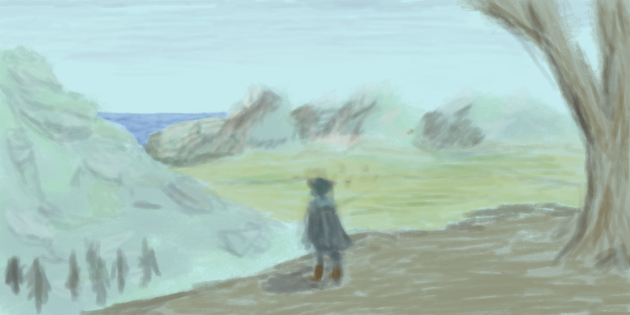

---
title: Tangled Orchard Studios
page_width: 60rem
---

```@section
style:
    textAlign: center
    maxWidth: 40rem
    margin: 0 auto
content$sea: |
    # Tangled Orchard Studios

    Tangled Orchard Studios is a creative development agency.  We are currently developing [Kestrel](projects/kestrel/kestrel), an digital adventure game designed to be accompanied by fan and core physical and digital expansions.
```


```@section
style:
content$sea: |
    ## Kestrel

```

<div style={{ display: 'flex', margin : '0 auto', flexDirection: 'row' }}>
    <div style={{ flexGrow : 1 }} />
    
    <div style={{ flexGrow : 1 }} />
</div>


```@option_columns
columns:
    -   title: Standard
        content$sea: |
            **For most users**, this is the release with game
            story and game mechanics.  This is the most highly tested release which is
            optimized to ensure the core adventure is playable.

            _Not yet released!_

    -   title: Extravagent
        content$sea: |
            **For the experienced or adventurous**, this release contains
            a much larger collection of plug-ins. These are less robustly tested together
            so may lead to game continuity quirks and bugs, but may lead to a more
            interesting and expansive world beyond the core story.

            _Not yet released!_

    -   title: Core
        content$sea: |
            **For mod or plug-in developers**, this release contains
            only the core engine and the minimal, core plug-ins within to run a world.

            _Not yet released!_
```


